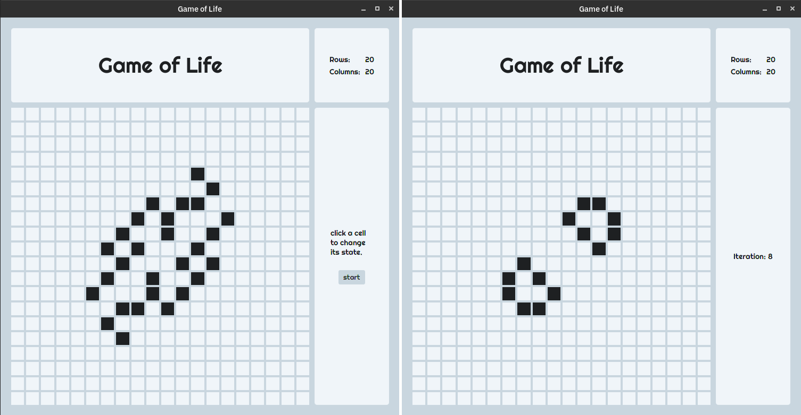

# Game of Life
Conway's Game of Life implemented in Java using JavaFX.



Learn about [Conway's Game of Life](https://en.wikipedia.org/wiki/Conway%27s_Game_of_Life).

## How to install
### Download JAR
An executable JAR is available for download through the releases tab.

### Compile From Source
To compile from source you will need **JDK 11**.

1. Clone the repository

```shell
git clone https://github.com/sudo-sturbia/Game-of-Life.git
```

2. The project uses **Gradle** as a build tool, For compatibility use the provided wrapper

```shell
./gradlew build
```

3. To run use

```shell
./gradlew run
```

The above steps can also be performed using an IDE.

## Features

- A minimal design with a simple configuration prompt.
- Dynamic grid size specified by the user at start.

